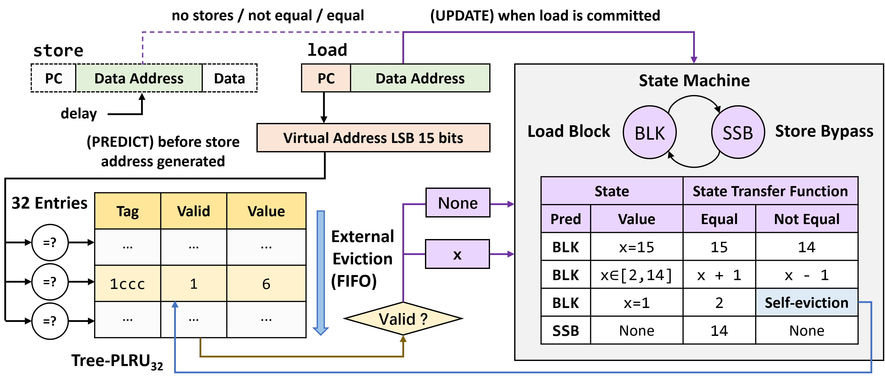

# SSBleed

## Introduction

This project presents the existence, key properties, and security implications of the Memory Dependence Predictor (MDP) on Armv9 CPUs. Through reverse engineering, we reveal the state machine, indexing mechanism, prediction table size, and replacement policy of the MDP on Neoverse-N2 CPUs, as shown in the Figure below. 



In addition, through a set of proof-of-concepts (PoCs), we demonstrate security issues of the MDP and three versions of the SSBleed attacks exploiting it.

The code of reverse engineering is in the directory `reverse-engineering`, and the PoC of the three variants of SSBleed is in the directory `proof-of-concepts`. In specific, the repository is organized as follows:

```shell
.
├── proof-of-concepts			-- SSbleed PoC (Section V)
│   ├── ssbleed-v1-poc			-- cross-process control-flow attack
│   ├── ssbleed-v2-poc			-- interrupt detection
│   └── ssbleed-v3-poc			-- transient attack
└── reverse-engineering		    -- Reverse Engineering of MDP (Section III and IV)
    ├── Makefile
    ├── bin						-- binaries generated via Makefile
    ├── data					-- experimental outputs
    ├── demo					-- figures illustrated in README files	
    ├── existence.py			-- test the existence of MDP
    ├── replacement_policy.py	-- test the replacement policy of MDP
    ├── src						-- source codes for reverse engineering
    ├── state_machine.py		-- test the state machine of MDP
    ├── table_index.py			-- test the indexing mechanism of MDP
    ├── table_size.py			-- test the table size of MDP
    └── timing_difference.py	-- demonstrate the timing difference of probe primitives
```

## Experimental Environment

We perform the experiments on the Microsoft Azure D2ps v6 instance with the Ubuntu 24.04 kernel image. The kernel version is `6.14.0-1014-azure`.

## Build and Run

Please follow the `README.md` file in each subdirectory to build and run the codes.

## Research Paper

Our research on Armv9 MDP, including the reverse engineering and the SSBleed attack, is presented in paper *SSBleed: Non-speculative Side-channel Attacks via Speculative Store Bypass on Armv9 CPUs*. The paper has been accepted in the 32th International Symposium on High-Performance Computer Architecture (HPCA 2026).

