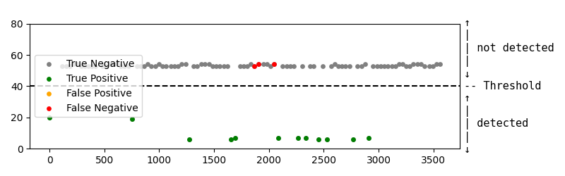

# SSBleed-v2 Proof-of-concept

## Introduction
This repository contains the PoC code for Section V.C of the paper. By following the steps below, you should be able to reproduce results similar to Fig. 14.

## Quick Start
You can run and get results without modifying or deeply understanding the code. Note that `generate_addr.sh` inserts a kernel module and therefore requires `sudo` privileges. You can inspect the kernel module source in the `kernel` folder (which is safe).

```bash
chmod +x generate_addr.sh
chmod +x attack.sh
pip3 install -r req

./generate_addr.sh 10
```

You should see output similar to:
```
Stable addresses: ['0x22d0', '0x2368', '0x2370', '0x1434', '0x1440', '0x1448', '0x3478', '0x151c', '0x7564', '0x77b4', '0x291c', '0x59a8', '0x2a00', '0x2a04', '0x2a08', '0xa70', '0xa74', '0x1ac8', '0x1b9c', '0x1ba0', '0x1c30', '0x3c74', '0x5c98', '0x4cb0', '0x4cc0', '0x6dfc', '0x5ee4', '0x5f78', '0x6284', '0x2340', '0x66b8', '0x76f8', '0x828', '0x7a30', '0x7ad0', '0x1ba8', '0x6cd4', '0xd40', '0x2d44', '0x1eb8', '0x1154', '0x2198', '0x7350', '0x1884', '0xf34', '0x3ad8']
Final addresses: ['0x1c30', '0x66b8', '0xd40']
```

Sometimes you may see:
```
Stable addresses: ['0x31ec']
No final addresses found. You can use stable address as the final address, but it may lead to bad results.
```

Finally, run the attack. The first parameter is not important; the second parameter is the chosen load address (e.g., `0xabcd`):
```bash
./attack.sh [test.txt] [load address]
```

The experimental results will be illustrated in a generated figure `interrupt.png`. An example figure is as follows:



## Code Structure
### load_filter
- `load_generator.c`: Filters characteristic loads of a specific interrupt (lower 14 bits of the address). You can edit the TODO in the `train` function to change the target interrupt or function. `load_generator` writes raw monitoring results (all observed loads during target execution) to the `data` folder.
- `filter.py`: Selects stable characteristic loads according to rules in two rounds. Round 1 yields stable addresses; Round 2 yields final addresses. This step is not guaranteed to produce final addresses. We tested many interrupt types—most yield stable addresses; a few can be refined to final addresses via two rounds.

### poc
- `single_target.c`: Simulates random interrupts and idle periods over time. Monitors specific loads and classifies them based on time thresholds, using the output from `load_filter`. Raw data is written to the `data` folder.
- `plot.py`: Plots based on outputs from the `data` folder.

## Contact

Please contact `zhenghp23@mails.tsinghua.edu.cn` for any techqinue helps.