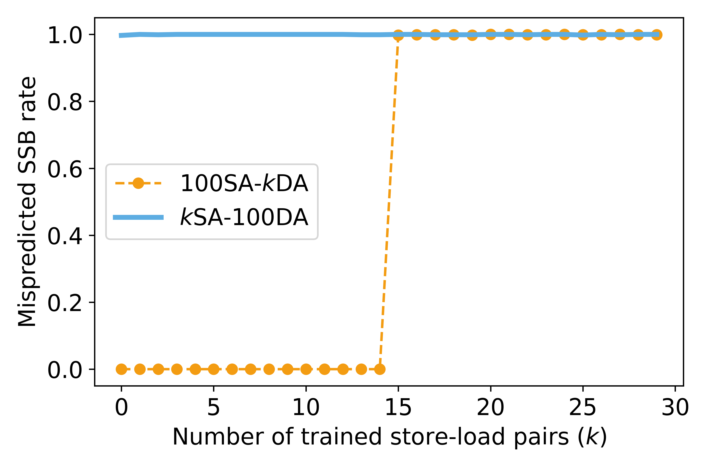
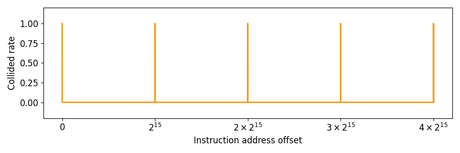
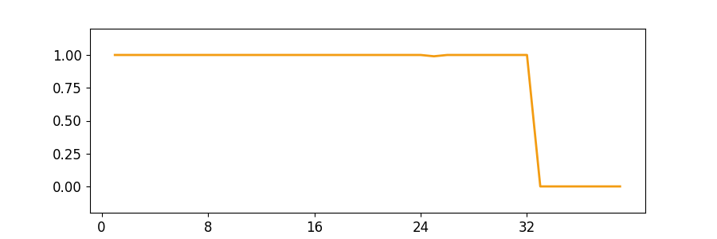
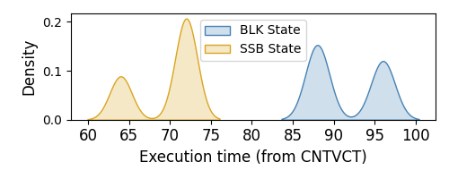

# Reverse Engineering of MDP

## Introduction

This directory contains the source code and experimental results used for reverse-engineering the Neoverse-N2 MDP, corresponding to Section 3 and 4 of our paper. Specifically, we test the following MDP properties:

- **Existence:** We use the Flush+Reload cache side channel to observe whether dynamic Speculative Store Bypassing (SSB) exists, and infer whether an MDP exists. (Section III-A)
- **State Machine:** We observe how MDP predictions affected by store–load pairs with different data dependence, enabling us to reverse-engineer the MDP state machine. (Section III-B)
- **Table Index:** We train and probe the MDP using loads from different instruction addresses, and evaluate whether index collisions occur. (Section III-C)
- **Table Size:** We train the MDP with multiple non-colliding loads and measure how many loads are required before the first entry is evicted. (Section III-C)
- **Replacement Policy:** We study how self-evictions affect the replacement priority of other table entries. (Section III-D)
- **Prime-and-Probe Primitives:** We show that different MDP states cause distinguishable timing gaps between store–load pairs, which allows user-level probing of the counter values maintained in MDP entries. (Section IV-C)

## Environment Setup

We use `matplotlib` and `seaborn` for plotting. Install the python packages through:

```
pip3 install -r requirement.txt
```

## Build

A C compiler is required. For example, we use gcc 13.3.0 with make 4.3. No kernel modifications or additional packages are required. Executables are generated under `bin` using:

```shell
make
```

## Existence Test

### Run

Launch the binary `bin/existence` through `existence.py`:

```shell
python3 existence.py
```

### Expected Results

A figure named `existence.png` will be generated in the directory `data`. This result is reported in the first subplot of Fig. 2 in our research paper.

The expected results are as follows:



## State Machine Test

### Run

Launch the binary `bin/state_machine` through `state_machine.py`:

```shell
python3 state_machine.py
```

### Expected Results

The state of MDP after executing a sequence of dependent or independent store-load pairs will be listed in the text format. The results are reported in Table 1 in our research paper.

The expected results are as follows:

```shell
15 DA: SSB
15 DA, 1 SA: BLK
1 SA, 13 DA: BLK
1 SA, 14 DA: SSB
10 SA, 14 DA: BLK
10 SA, 15 DA: SSB
1 SA, 10 DA, 1 SA, 4 DA: BLK
1 SA, 10 DA, 1 SA, 5 DA: SSB
```

## Table Index Test

### Run

Launch the binary `bin/table_index` through `table_index.py`:

```shell
python3 table_index.py
```

### Expected Results

A figure named `table_index.png` will be generated in the directory `data`. This result is reported in the first subplot of Fig. 3 in our research paper.

The expected results are as follows:



## Table Size Test

### Run

Launch the binary `bin/table_org` through `table_size.py`:

```shell
python3 table_size.py
```

### Expected Results

A figure named `table_size.png` will be generated in the directory `data`. This result is reported in the third subplot of Fig. 3 in our research paper.

The expected results are as follows:



## Replacement Policy Test

### Run

Launch the binary `bin/replacement_policy` through `replacement_policy.py`:

```shell
python3 replacement_policy.py
```

### Expected Results

The permutation `PI_0`, `PI_1`, `PI_2`, `PI_3`, `PI_15`, `PI_16`, `PI_30` and `PI_31` will be displayed in the text format. The results are reported in Fig. 4 in our research paper.

The expected results are as follows:

```shell
Cleared Entry 0 : evict entry [0]
Cleared Entry 0 : evict entry [0, 1]
Cleared Entry 0 : evict entry [0, 1, 2]
Cleared Entry 0 : evict entry [0, 1, 2, 3]
Cleared Entry 0 : evict entry [0, 1, 2, 3, 4]
Cleared Entry 0 : evict entry [0, 1, 2, 3, 4, 5]
...
Cleared Entry 31 : evict entry [0, 1, 2, 3, 4, 5, 6, 7, 8, 9, 10, 11, 12, 13, 14, 15, 16, 17, 18, 19, 20, 21, 22, 23, 24, 25, 26, 27, 28, 31]
Cleared Entry 31 : evict entry [0, 1, 2, 3, 4, 5, 6, 7, 8, 9, 10, 11, 12, 13, 14, 15, 16, 17, 18, 19, 20, 21, 22, 23, 24, 25, 26, 27, 28, 29, 31]
Cleared Entry 31 : evict entry [0, 1, 2, 3, 4, 5, 6, 7, 8, 9, 10, 11, 12, 13, 14, 15, 16, 17, 18, 19, 20, 21, 22, 23, 24, 25, 26, 27, 28, 29, 30, 31]
PI_0 = [1, 2, 3, 4, 5, 6, 7, 8, 9, 10, 11, 12, 13, 14, 15, 16, 17, 18, 19, 20, 21, 22, 23, 24, 25, 26, 27, 28, 29, 30, 31]
PI_1 = [0, 3, 2, 5, 4, 7, 6, 9, 8, 11, 10, 13, 12, 15, 14, 17, 16, 19, 18, 21, 20, 23, 22, 25, 24, 27, 26, 29, 28, 31, 30]
PI_3 = [0, 1, 2, 7, 4, 5, 6, 11, 8, 9, 10, 15, 12, 13, 14, 19, 16, 17, 18, 23, 20, 21, 22, 27, 24, 25, 26, 31, 28, 29, 30]
PI_15 = [0, 1, 2, 3, 4, 5, 6, 7, 8, 9, 10, 11, 12, 13, 14, 31, 16, 17, 18, 19, 20, 21, 22, 23, 24, 25, 26, 27, 28, 29, 30]
PI_16 = [1, 2, 3, 4, 5, 6, 7, 8, 9, 10, 11, 12, 13, 14, 15, 0, 17, 18, 19, 20, 21, 22, 23, 24, 25, 26, 27, 28, 29, 30, 31]
PI_30 = [1, 0, 3, 2, 5, 4, 7, 6, 9, 8, 11, 10, 13, 12, 15, 14, 17, 16, 19, 18, 21, 20, 23, 22, 25, 24, 27, 26, 29, 28, 31]
PI_31 = [0, 1, 2, 3, 4, 5, 6, 7, 8, 9, 10, 11, 12, 13, 14, 15, 16, 17, 18, 19, 20, 21, 22, 23, 24, 25, 26, 27, 28, 29, 30]

```

## Timing Difference Test

### Run

Launch the binary `bin/timing_difference` through `timing_difference.py`:

```shell
python3 timing_difference.py
```

### Expected Results

A figure named `timing_difference.png` will be generated in the directory `data`. This result is reported in Fig. 9 in our research paper.

The expected results are as follows:



